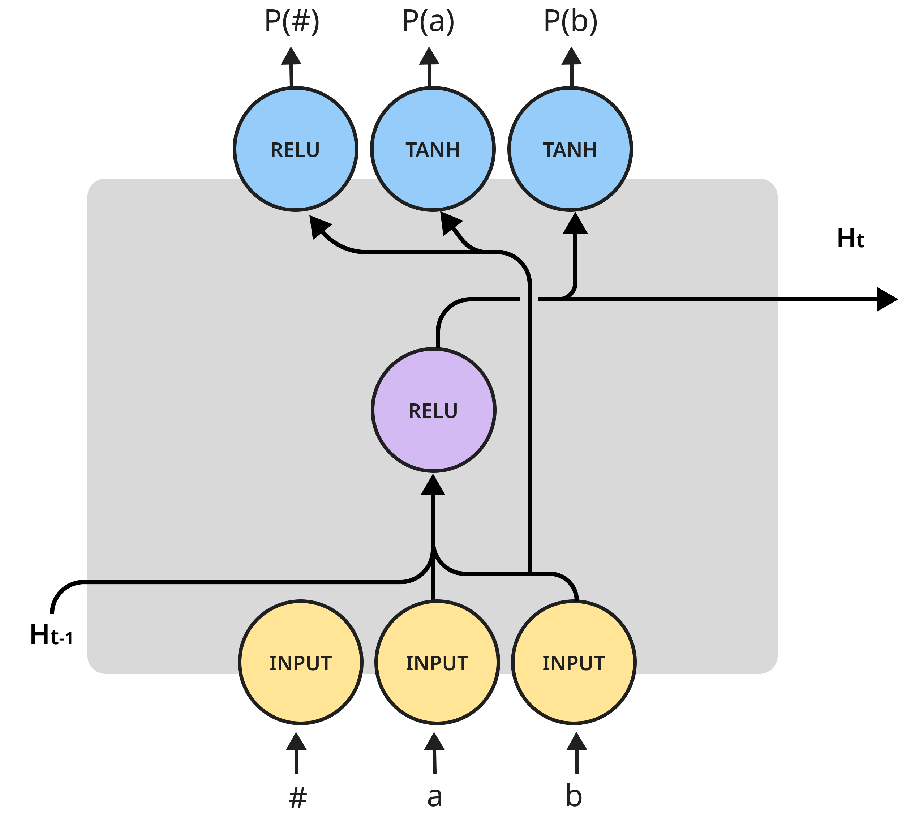

# MDLRNN-torch 

### PyTorch port of Minimum Description Length Recurrent Neural Networks (MDLRNNs)

MDLRNNs are recurrent neural nets that optimize the MDL objective, an approximation of Kolmogorov Complexity.
This is done by minimizing the encoding length of the network's architecture itself, alongside the classical loss.

Optimizing for encoding length makes it possible to prevent overfitting and reach perfect generalizations for many formal languages that aren't learned well by classical models, such as `aⁿbⁿ` and `Dyck-1`.

It also results in very small networks, such as this `aⁿbⁿ` RNN cell that only has one hidden unit that serves as a counter:



## Pre-trained models

`./models` contains pre-trained networks for the following formal languages:

| Language | # Hidden units   | Network checkpoint  | Test accuracy | Test set                                                                    | 
|----------|------------------|---------------------|---------------|-----------------------------------------------------------------------------|
| aⁿbⁿ     | 1                | an_bn.pt            | 100%          | All strings `n<=5000`                                                       |
| aⁿbⁿcⁿ    | 5                | an_bn_cn.pt         | 99.7%         | All strings `n<=5000`                                                       |
| aⁿbᵐcⁿ⁺ᵐ | 1                | an_bm_c_n_plus_m.pt | 100%          | First 5,000 strings (sorted by `n+m`)                                       |
| Dyck-1   | 1                | dyck1.pt            | 100%          | First 5,000 strings (listed [here](https://github.com/0xnurl/dyck-strings)) | 

More on evaluation metrics [here](https://direct.mit.edu/tacl/article/doi/10.1162/tacl_a_00489/112499/Minimum-Description-Length-Recurrent-Neural).

## Examples

### Accuracy test

* [examples/accuracy_test.py](examples/accuracy_test.py)

Demonstrate 100% accuracy on all `aⁿbⁿ` strings up to `n=1000`.

### Fine-tuning

* [examples/fine_tuning.py](examples/fine_tuning.py)

MDLRNNs are trained using a genetic algorithm. By using only standard activations (ReLU, tanh, sigmoid) and a final normalization/softmax layer they can be further fine-tuned using regular backpropagation.   

### Language generation

* [examples/language_generation.py](examples/language_generation.py)

Generate continuations given a prefix, e.g. `#aaaaab...bbbb#`.

## Evolving networks from scratch for full MDL

MDLRNNs optimize the Minimum Description Length objective, which isn't differentiable. We use a genetic algorithm to evolve networks and then port them to PyTorch, freezing the architecture but not the weights. 

To evolve networks from scratch using a genetic algorithm, use the Genetic Algorithm MDLRNN trainer here:
https://github.com/taucompling/mdlrnn/

## Contributing networks

Training MDLRNNs is compute intensive, since the [genetic algorithm](https://github.com/taucompling/mdlrnn/) is highly parallelizable and works better the more CPUs you have.

Feel free to train more MDLRNNs using the genetic algorithm and upload them here through a Pull Request. See our [paper](https://direct.mit.edu/tacl/article/doi/10.1162/tacl_a_00489/112499/Minimum-Description-Length-Recurrent-Neural) for unsolved problems, such as `Dyck-2` and `aⁿbⁿcⁿdⁿ`.   

## Citing this work

Please use this BibTeX if you wish to cite this project in your publication:

```
@article{Lan-Geyer-Chemla-Katzir-MDLRNN-2022,
  title = {Minimum Description Length Recurrent Neural Networks},
  author = {Lan, Nur and Geyer, Michal and Chemla, Emmanuel and Katzir, Roni},
  year = {2022},
  month = jul,
  journal = {Transactions of the Association for Computational Linguistics},
  volume = {10},
  pages = {785--799},
  issn = {2307-387X},
  doi = {10.1162/tacl_a_00489},
}
```
